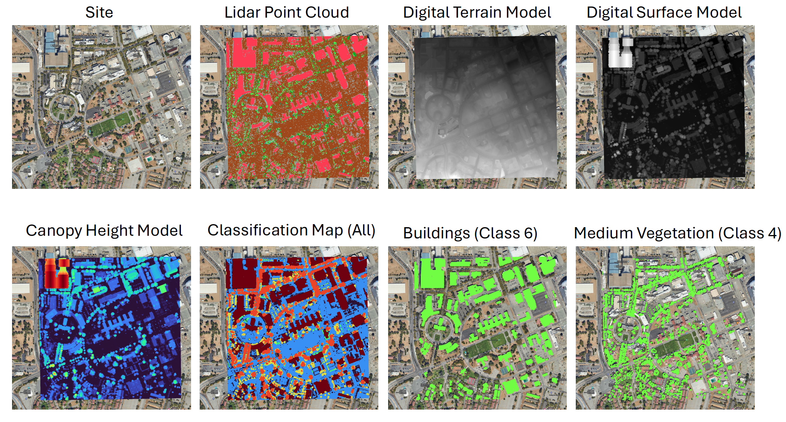

# lidar-utils: An aerial lidar point cloud data processing pipeline 
The programs within this directory were designed with the intent of processing aerial lidar data point clouds taken from the United States Geological Survey's 3D Elevation Program (3DEP). The code is designed to receive a path to an input directory that contains the .las or .laz point cloud files, a path to an output directory where the derivative products will be stored, the number of CPU cores that will be used, and keywords that can specify whether the entire directory or a subset of files will be processed. lidar-utils makes use of open-source software such as **PDAL** and **GDAL** as well as Python's in-built **multiprocessing** module to efficiently create rasterized elevation products as GeoTIFFs. Note that the pipeline was designed to process data from the USGS 3DEP program which uses standards such as the US Survey Foot to record elevation values. The resulting pipeline products record elevations in units of meters. 



## Install the Environment
First, install the necessary Python packages through the environment.yml file. To do this, download the repository and perform the following commands. The pipeline was developed with Python version 3.12.0.

```
cd 3dep-lidar-processing
conda env create -f environment.yml
```
## How to Run
As of this version, the most straight forward approach to apply this code is to replace the following variables within the **lidar_utils.py** script:

```
# Example Usage: Using 3 CPUs, process the first 9 .laz files within the directory input
data_directory = 'path-to-laz-files'
oput_dir = 'path-to-output-directory'
if __name__ == '__main__':
    process_directory(data_directory, oput_dir,num_cores,n_start,n_end)
```

*data_directory*: The directory where the .las or .laz aerial lidar point clouds are hosted.

*oput_dir*: The desired output directory where the four lidar derivative products (Digital Terrain Model (DTM), Digital Surface Model (DSM), Canopy Height Model (CHM), and Land Cover Classification Maps.

*num_cores*: The number of CPU processors that will be used. Each processor will independently process a .las or .laz file.

*n_start*: Starting index used to indicate where in the sorted list of .laz files the processing will begin. Default is **None**.

*n_end*: Ending index used to indicate where in the sorted list of .laz files the processing will end. Default is **None**.

Note that if *n_start* and *n_end* are both set to **None**, all of the .laz files within the directory will be processed.

## Description of Derivative Products

DTM: A digital terrain model (DTM) is a rasterized topographic model of the bare Earth elevation. The pipeline-generated DTMs use **nearest neighbor** interpolation to estimate the ground elevations underneath surfaces such as vegetation and buildings. Points on the surface where no lidar returns are available (such as bodies of water) are left un-interpolated to avoid incorrectly assigning an elevation where no data is present.

DSM: The digital surface model captures both natural and artificial features on the Earth surface. This includes elevation measurements of human-made structures such as buildings and houses as well as natural structures such as trees. DSMs represent the "highest hit" surface from a lidar return.

CHM: The canopy height model (also known as a digital height model or a normalized digital surface model) is simply the difference between the DSM and the DTM. This provides a measure of the height of objects measured with respect to the ground.

Classification Maps: The final derivative product is a GeoTIFF that contains a combined and individually separated land cover maps. The map product currently focuses on the first 6 standard classes of points set by the American Society for Photogrammetry and Remote Sensing (ASPRS).

1. Unclassified
2. Ground
3. Low Vegetation
4. Medium Vegetation
5. High Vegetation
6. Building

A description of standard point classes set by ASPRS can be found here: https://www.asprs.org/wp-content/uploads/2010/12/LAS_Specification.pdf

In cases where the point cloud's density is high and multiple classes can be found at a given raster grid cell, the pipeline will select the class with the highest elevation in the combined land cover map. An individual rasterized land cover map for each class is also included as a separate band within the GeoTIFF file. A threshold of DSM - DTM < 0.5 m was used to separate Class 2 (ground) and Class 1 (unclassified) points. 

## Additional Resources
Canopy Height Models, Digital Surface Models & Digital Elevation Models - Work With LiDAR Data in Python: https://www.earthdatascience.org/courses/use-data-open-source-python/data-stories/what-is-lidar-data/lidar-chm-dem-dsm/#:~:text=Digital%20Terrain%20Model%20(or%20DTM,of%20objects%20above%20the%20ground.

OpenTopography 3DEP Workflows: https://github.com/OpenTopography/OT_3DEP_Workflows

